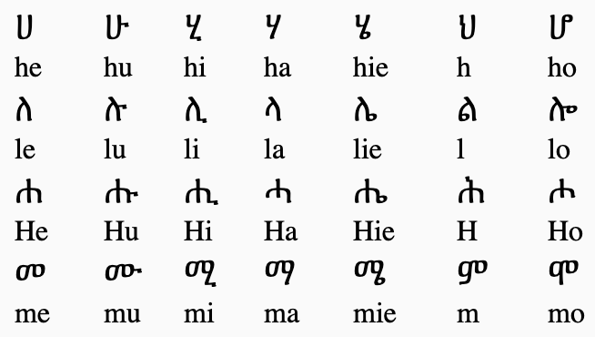

# Impact Week Project for Travis Foundation

There are over 500,000 native Tigrinya speakers in Europe. Currently the technology which would enable them to 
seamlessly translate between their native tongue and English does not exist. Travis Foundation plans to solve this problem.

For our Impact Week project at the Restart.Network we have created a simple web app which allows users to write in 
Tigrinya using regular Latin keyboard by converting phonetic sounds to equivalent Tigrinya characters. The app also includes an
on-screen Tigrinya keyboard, live translation, English-Tigryna translation, and an option to suggest improvements in translation.

## Tigrinya

There are over 200 Tigrinya symbols. Our app allows users to write all of them using standard Latin keyboard.

Alternatively our users can use on-screen keyboard. We've arranged the characters in an intuitive and user-friendly manner.

, [Anna](https://github.com/SaltyAga), and [Robert](https://github.com/Kvasek).
